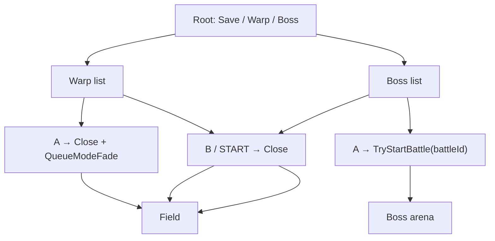

# Overworld Debug Menu

---

## Index

- [Introduction](#introduction)
- [Plan](#plan)
- [Controls](#controls)
- [Warps](#warps)
- [Boss fights](#boss-fights)
- [Display model](#display-model)
- [Engine cooperation](#engine-cooperation)
- [Code Locations](#code-locations)
- [TODO](#todo)
- [Limitations & Bugs](#limitations--bugs)

## Introduction

Vanilla Sigma Star Saga only saves from the status / END panel. This hack adds a **START** overlay on overworld field modes: save anywhere, warp via the NAV table, and jump straight into any midboss or story boss fight.

Enable with `.debug_menu = TRUE` in `configs/runtime.c`.

## Plan

Root options:

1. **Save game** — EEPROM write to the current slot
2. **Warp to scene...** — NAV location list; **A** fades to that mode
3. **Boss fight...** — all 19 `MB_*` midbosses + 10 `B_*` story bosses; **A** starts that fight

It deliberately **never** calls `StatusToggle`, `StatusPanel`, `SetMode(0x168)`, or `LeaveStatusRestore`. `gMode` stays on the overworld value while the menu is open; world sim is paused by LynJumps on the overworld frame, not by changing modes. Warps close the overlay and then `QueueModeFade`; bosses close it and call `TryStartBattle`.

| Screen | Behaviour |
| --- | --- |
| Root | `Save game` / `Warp to scene...` / `Boss fight...` with UP/DOWN cursor |
| Warp | A opens NAV location list; A again → close overlay → `QueueModeFade(modeId)` |
| Boss | A opens the boss list; A again → `TryStartBattle(battleId)` |



## Controls

| Input | Context | Action |
| --- | --- | --- |
| START | Field (overworld frame) | Open / close menu |
| UP / DOWN | Any list | Move cursor (scrolls when needed) |
| A | Root → Warp / Boss | Enter that submenu |
| A | Warp list | Close menu and `QueueModeFade` to that location's mode ID |
| A | Boss list | Launch the selected boss |
| B | Warp / Boss list | Back to root |

## Warps

Warps use `QueueModeFade` (`0x0800D734`) — same path as StatusToggle: transition latch + fade-to-black + pending mode @ `0x03000D6C`. `FadeStep` applies `gMode` when the fade completes; map prep then runs from `OverworldMainFrame`.

## Boss fights

The roster is the full vanilla set of 29 fights: 19 midbosses (`MB_EYENUS` … `MB_ICEPETALS`) and 10 story bosses (`B_DRILL` … `B_PSYME`).

### Stage labels, not arena packs

The stage-label table @ `0x080ED50C` is 270 entries of `u16 id` + `char name[0x26]` (stride `0x28`), and its index **is** `gStageCase`:

| Label ids | Names |
| --- | --- |
| 0–226 | missions: `TRAINING_MISSION`, `FOREST_1_1`…`FOREST_5_10`, `FIRE_2_1`…, `FORGOT_5_1`…, `ICE_3_1`…`ICE_6_10`, `KRILL_*`, `SAND_4_1`…`SAND_6_10` |
| 227–245 | `MB_*` midbosses |
| 246–255 | `B_*` story bosses |
| 256–269 | `EARTH_*`, `END_GAME_DEATH_THROES`, `ALL_CLEAR`, `ENEMY_TESTER` |

That table is why earlier revisions of this menu dropped the player into ice-planet missions: **135–174 are `ICE_3_1`…`ICE_6_10`**, so `gStageCase = 142` asked for `ICE_3_8`, not a Drill arena. The `setModeId` values that looked like boss labels (246, 247, …) are ids in `SetMode`'s own, larger id space and do not index the label table.

`EnterStageArena`'s jump table @ `0x0802972C` is also indexed by label id, but only five boss labels have their own arena handler — `B_BLUNE` (248), `B_LAVAWORM` (249), `B_MEATHEAD` (250), `B_SEVENSPINE` (253), `B_PSYME` (255). The other 24 land on the shared epilogue `0x0802AD50`, which issues no `SetMode` at all, so poking `gStageCase` can never reach them.

### Launching through the battle record

Every boss instead owns a battle record whose **id equals its label id**, in the battle table @ `0x0824EE80` (count @ `0x080ED014`, 297 records). Starting one is the same call the overworld lure objects make, so the record's own command list picks the arena and spawns the boss:

```c
gStageClearFlag = 0;
gStageClearGate = 0;
DebugMenu_Close();
TryStartBattle(entry->battleId); /* 227..255 */
```

Record layout (20 bytes, from `TryStartBattle` @ `0x08014828` / `StartBattle` @ `0x08018C38`):

| Offset | Field |
| --- | --- |
| `+0` | `s32` battle id |
| `+4` / `+8` | intro command count / pointer |
| `+12` / `+16` | wave command count / pointer |

Commands are 88-byte structs with a `u32` opcode at `+0` dispatched through the 18-entry table @ `0x0801870C`. Opcode 9 is the flight entry: `StartBattle` checks `intro[0].op == 9` and calls `ChangeMode(0x9B)`.

### Planet grouping

No ROM table links a boss to a planet. The label table groups missions by **chapter** (1–6), and chapters are shared across planets — `FOREST` spans chapters 1–5, `FIRE` 2–6, `ICE` 3–6, `SAND` 4–6, `FORGOT` 5–6, `KRILL` 6. Each planet's *own* chapter is therefore the first one its missions appear in, which matches the game's six chapters / six planets structure.

Story boss placements come from that plus the walkthrough boss order; midboss placements are thematic and provisional.

| Planet (chapter) | Midbosses | Story bosses |
| --- | --- | --- |
| Forest (1) | Greenone 232, Greenturkey 234, Vulturehead 229, Flower 239 | Drill 246, Blune 248 |
| Fire (2) | Tetrill 231, Centi 237 | Lavaworm 249 |
| Ice (3) | Flice 228, Silverfish 242, Icepetals 245 | Sevenspine 253 |
| Sand (4) | Crab 236, Viper 241, Gunorbship 244 | Concentrator 247 |
| Forgotten (5) | Eyenus 227, Boogey 230, Innereye 233, Doppelganger 235, Sothoth 243 | Spectrodactyl 252 |
| Krill / finale (6) | Helper 238, Cerebellum 240 | Battleworm 251, Rrrobot 254, Psyme 255, Meathead 250 |

Anchors behind those placements:

| Boss | Evidence |
| --- | --- |
| `B_DRILL` | chapter 1 boss ("The Big Drill") |
| `B_LAVAWORM` | chapter 2 boss, the worm that spits lava and magma balls |
| `B_SEVENSPINE` | arena renders as the ice field (probe screenshot) |
| `B_CONCENTRATOR` | chapter 4 boss |
| `B_BLUNE` | chapter 3 sends the player back to the Forest planet to kill Blune |
| `B_SPECTRODACTYL` | chapter 5 "Ghost of Iot" on the haunted planet |
| `B_MEATHEAD` | final boss — giant face, background holes, tentacles, eye beam |
| `B_RRROBOT` | chapter 3 Sigma fleet assault ("Robotech wanna-be") |
| `B_PSYME` | chapter 6 Battleworm rematch, flown by Psyme |
| `MB_FLOWER` | Forest planet flying-flower midboss |
| `MB_GUNORBSHIP` | Sand planet twin-orbiting-shield midboss |
| `MB_DOPPELGANGER` | Forgotten planet fighter that mirrors the player |

## Display model

While open:

| Layer | Setup | Role |
|-------|--------|------|
| BG0 | CB2 / SB30, pal bank 15 | Option list / `Saving…` / `Saved!` |
| BG1 | CB2 / SB31, blank tile 0 | Solid black fill |
| BG2–BG3 / OBJ | Off via `gDisplayCtrlMirror` | Hide world + HUD |

Text is written **directly** into VRAM screenbase 30. Soft-text (`ClearSoftTextMap` / `DrawDebugText`) is avoided: those set `gSoftTextDirty`, and VBlank then DMA-reloads soft maps every frame and fights the overlay.

Repaints only run when `gDebugMenuTextState` changes (cursor moves force `DBG_TEXT_NONE`), and they wait on VBlank first.

## Engine cooperation

Two engine paths still run every frame from the main-loop epilogue @ `0x0800BB00`, **outside** both LynJump sites. Pausing the overworld frame body does not stop them:

| Path | Address / symbol | What the menu does |
|------|------------------|--------------------|
| `HudSync(1)` | `0x08010E58`, called from `0x0800BB98` | Rebuilds HUD tilemap unless `gHudEnabled == 0` |
| Status DISPCNT mirror | `gDisplayCtrlMirror` @ `0x03007194` | Re-applied to `REG_DISPCNT` every frame; menu drives this mirror, not hardware alone |

On close, restore cameras, VRAM snapshot, DISPCNT mirrors, and soft-text dirty bits as documented in prior revisions.

## Code Locations

| Feature | Location | Description |
|---------|----------|-------------|
| Runtime toggle | `.debug_menu` in `configs/runtime.c` | Enables LynJumps + menu logic |
| Menu body | `DebugMenu_*` in `src_custom/debug_menu_hooks.c` | Open / present / save / warp / boss / close |
| Public API | `DebugMenu_IsBlocking` / `DebugMenu_OnOverworldFrame` in `include/debug_menu.h` | Gate + per-frame entry |
| Mode thunks | `ChangeMode` / `QueueModeFade` in `include/status.h` | Warp entry |
| Battle entry | `TryStartBattle` in `include/overworld_encounters.h` | Boss entry |
| Boss table | `sDebugBosses` in `src_custom/debug_menu_hooks.c` | Name + battle id (227–255) |
| Arena selector | `gStageCase` in `asm/ram_map_iwram.s` | Dig arena case for host mode 132 |
| Boss probe | `tools/mgba_boss_probe.c` | Replays boss rows; sweeps `gStageCase` |

## TODO

- [ ] More menu entries (flags, item grants) behind the same overlay
- [ ] Pin full BG palette bank 15 so text color does not inherit field leftovers
- [ ] Drop temporary `DEBUG_MENU_LOG` / No$ prints once the overlay is considered stable
- [ ] Optional non-blocking save (today `WriteSave` freezes the CPU for ~20 frames on EEPROM)
- [ ] Friendlier warp labels and optional raw ID pickers
- [ ] Confirm the provisional midboss planet placements in-game (story bosses are anchored; midbosses are thematic guesses)
- [ ] Re-verify the 29 rows in `tools/mgba_bossbattle_probe.c`. Its boot drive lands on `gStageCase = 269` (`ENEMY_TESTER`) with a black frame, so its blank/working verdicts are not trustworthy — it needs a savestate taken in a real overworld field.
- [x] Full 29-row roster (19 `MB_*` + 10 `B_*`) launched via `TryStartBattle`
- [x] Fade-out before warp via `QueueModeFade` (StatusToggle path)

## Limitations & Bugs

- Opens only when the current `gMode`'s main-loop JT slot points at `OverworldMainFrame` (`0x0800D610`). Flight, cutscenes, and status mode are out of scope.
- Save uses the **current** `gSaveSlot`. There is no in-menu slot picker yet.
- Warp uses `QueueModeFade` (fade then pending `gMode`); spawn position / facing come from whatever the destination mode's prep uses (not a full door-record teleport).
- Midboss planet labels are provisional; the story boss labels are anchored to chapter order and arena screenshots.
- Boss rows arm a vanilla battle from wherever the player is standing. A fight whose record expects story state (a specific chapter or planet) can still behave oddly; `MB_ICEPETALS` for one runs a chapter transition.
- With `.skip_flight_battle` on, **SELECT+L** still force-clears an in-progress flight stage.

Report save/restore/warp/boss glitches with the field `gMode`, destination / battle ID, whether `.debug_menu` was on, and a screenshot of the open and closed frames.
