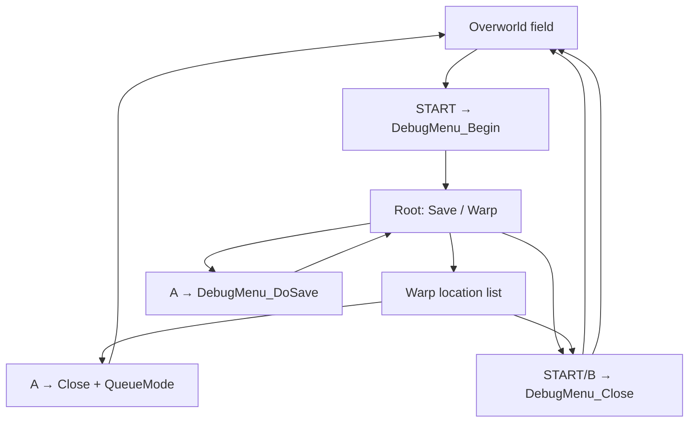

# Overworld Debug Menu

---

## Index

- [Introduction](#introduction)
- [Plan](#plan)
- [Controls](#controls)
- [Display model](#display-model)
- [Engine cooperation](#engine-cooperation)
- [Code Locations](#code-locations)
- [TODO](#todo)
- [Limitations & Bugs](#limitations--bugs)

## Introduction

Vanilla Sigma Star Saga only saves from the status / END-SAVE UI. For hack development that is awkward: you have to leave the field, open SELECT status, and hope the slot path still works.

This feature adds a **mode-preserving** overworld overlay:

1. **START** on a walking field mode opens a black screen with a scrollable option list.
2. **Save game** — **A** saves the current slot anywhere (END-SAVE style EEPROM commit).
3. **Warp to scene...** — pick a NAV location (Starbase / planet / palace / …) and **A** queues that mode.
4. **START / B** closes and restores the field (HUD, cameras, VRAM tiles).

It deliberately **never** calls `StatusToggle`, `StatusPanel`, `SetMode(0x168)`, or `LeaveStatusRestore`. `gMode` stays on the overworld value while the menu is open; world sim is paused by LynJumps on the overworld frame, not by changing modes. Warps close the overlay first, then call `QueueMode`.

Toggle: `configs/runtime.c` → `.debug_menu`.

## Plan

| Layer | Behavior |
|-------|----------|
| Gate | `.debug_menu` + overworld field mode (mode JT entry = `OverworldMainFrame` @ `0x0800D610`) + status panel closed |
| Open | START edge → snapshot display / HUD / cameras / charbase-2 → load debug font → black overlay |
| Idle | World frame body skipped; menu owns BG0 text + BG1 black fill |
| Root | `Save game` / `Warp to scene...` with UP/DOWN cursor |
| Save | A → `Saving…` → `SetSaveSlot` → `FlushSaveMeta` → `WriteSave` → `Saved!` (~90 frames) |
| Warp | A opens NAV location list; A again → close overlay → `QueueMode(modeId)` |
| Close | START (any page) / B (root) → restore mirrors + cameras + font tiles → dirty all soft maps |
| Toggle off | If `.debug_menu` is FALSE at runtime, any open menu force-closes and LynJumps leave vanilla frame code |

## Controls

| Input | When | Effect |
|-------|------|--------|
| START | Field, menu closed | Open menu |
| UP / DOWN | Menu idle | Move cursor (list scrolls past 18 rows) |
| A | Root → Save | Save current slot; show `Saving…` then `Saved!` |
| A | Root → Warp | Enter location list |
| A | Warp list | Close menu and `QueueMode` to that location's mode ID |
| B | Warp list | Back to root |
| B / START | Root idle | Close and restore overworld |
| START | Warp list | Close and restore overworld |
| A / B / START | During `Saved!` timer | Dismiss status text early |

SELECT / status is untouched. Opening status while the menu is somehow still marked open force-closes the overlay.

### Warp destinations

Names and mode IDs come from the vanilla NAV table @ `0x0824F348` (24 entries: `u32 modeId` + `name[0x20]`). Examples: `EARTH`→9, `STARBASE1`→18, `FOREST`→4, `FIRE`→5, `FORGOTTEN`→17, `PALACE`→16, `LAUNCH EARTH`→24.

Warps use `QueueMode` (`0x0800D71C`) — set transition latch + `ChangeMode` — matching door / status deferred switches. Map prep is the per-`gMode` JT @ `0x0801A1A0` (`gMode - 4`).

## Display model

While open:

| Layer | Setup | Role |
|-------|--------|------|
| BG0 | CB2 / SB30, pal bank 15 | Option list / `Saving…` / `Saved!` |
| BG1 | CB2 / SB31, blank tile 0 | Solid black fill |
| BG2–BG3 / OBJ | Off via `gDisplayCtrlMirror` | Hide world + HUD |

Text is written **directly** into VRAM screenbase 30. Soft-text (`ClearSoftTextMap` / `DrawDebugText`) is avoided: those set `gSoftTextDirty`, and VBlank then DMA-reloads soft maps every frame and fights the overlay.

Repaints only run when `gDebugMenuTextState` changes (cursor moves force `DBG_TEXT_NONE`), and they wait on VBlank first. Clearing the whole 32×32 map mid-frame was what made the text tear / flicker in and out.

## Engine cooperation

Two engine paths still run every frame from the main-loop epilogue @ `0x0800BB00`, **outside** both LynJump sites. Pausing the overworld frame body does not stop them:

| Path | Address / symbol | What the menu does |
|------|------------------|--------------------|
| `HudSync(1)` | `0x08010E58`, called from `0x0800BB98` | Rebuilds HUD tilemap unless `gHudEnabled == 0` |
| Status DISPCNT mirror | `gDisplayCtrlMirror` @ `0x03007194` | Re-applied to `REG_DISPCNT` every frame; menu drives this mirror, not hardware alone |

On close, restore:

1. `gDisplayCtrlMirror`, `gHudEnabled`, soft DISPCNT, hardware `BGxCNT`, blend/windows, IE/DISPSTAT.
2. Full `gCameras` array (font load re-points layer 3; overlay zeroes active flags / scroll).
3. Charbase-2 tile snapshot (`gDebugMenuVramSnap`, `0x4000` bytes).
4. `gSoftTextDirty = 0x1F` so VBlank repaints every soft map the overlay wrote over.

`gSoftBg2Pa` / `gSoftBg2Pb` (`0x03001E7C` / `0x03001F6C`) are **affine batch** mirrors, not BG0/BG1 soft CNT. Do not treat them as BGxCNT shadows.

## Code Locations

| Feature | Location | Description |
|---------|----------|-------------|
| Runtime toggle | `.debug_menu` in `configs/runtime.c` | Enables LynJumps + menu logic |
| Menu body | `DebugMenu_*` in `src_custom/debug_menu_hooks.c` | Open / present / save / warp / close / restore |
| Public API | `DebugMenu_IsBlocking` / `DebugMenu_OnOverworldFrame` in `include/debug_menu.h` | Gate + per-frame entry |
| Mode thunks | `ChangeMode` / `QueueMode` / `EnterModeScene` in `include/status.h` | Warp + special scene entry |
| Frame LynJumps | `OverworldMainFrame__Replacement` / `OverworldFrameTail__Replacement` | Skip world body / cameras while open; jump to epilogue `0x0800D6CF` when blocking |
| Player gate | `DebugMenu_IsBlocking` call in `src_custom/flight_skip_hooks.c` | Freeze player update while menu open |
| LynJump apply | `apply_debug_menu` in `tools/apply_lynjump.py` | Hooks @ `0xD610` (main) and `0xD66A` (tail) |
| Save path | `SetSaveSlot` / `FlushSaveMeta` / `WriteSave` in `src/save.c` | END-SAVE style; not player-FSM `SaveCommitPrep` |
| Warp table | ROM `0x0824F348` | NAV `modeId` + name (24 entries, stride `0x24`) |
| EWRAM state | `gDebugMenu*` in `asm/ram_map_ewram.s` | Active, screen, scroll, text state, snapshots |
| IWRAM mirrors | `gDisplayCtrlMirror` / `gHudEnabled` in `asm/ram_map_iwram.s` | Status-module DISPCNT shadow + HudSync enable |
| Probe harness | `tools/mgba_debug_menu_probe.c` | Headless open / save / close + framebuffer dumps |

## TODO

- [ ] More menu entries (flags, item grants) behind the same overlay
- [ ] Pin full BG palette bank 15 so text color does not inherit field leftovers
- [ ] Drop temporary `DEBUG_MENU_LOG` / No$ prints once the overlay is considered stable
- [ ] Optional non-blocking save (today `WriteSave` freezes the CPU for ~20 frames on EEPROM)
- [ ] Friendlier warp labels (Title Case) and optional raw mode-ID picker
- [ ] Fade-out before `QueueMode` to match door transitions

## Limitations & Bugs

- Opens only when the current `gMode`'s main-loop JT slot points at `OverworldMainFrame` (`0x0800D610`). Flight, cutscenes, and status mode are out of scope.
- Save uses the **current** `gSaveSlot`. There is no in-menu slot picker yet.
- `WriteSave` polls EEPROM ready bits in ROM and blocks for roughly a frame per word; the menu shows `Saving…` so the freeze is intentional feedback, not a hang.
- Warp only queues the mode ID; spawn position / facing come from whatever the destination mode's prep uses (not a full door-record teleport).
- Text color can look cyan/orange/etc. depending on leftover entries in palette bank 15; only indices 0 and 1 are forced black / white.
- Charbase 2 is shared with the HUD and some world layers; the overlay snapshots and restores it, but a failed close path will leave garbage glyphs in the field.
- Soft BG0/BG1 CNT mirrors do not exist; snapshotting the old mislabeled affine symbols will not restore layer setup.
- Headless mGBA may need `GBASavedataForceType(..., SAVEDATA_EEPROM512)` — autodetect can leave type unresolved and the ready poll never completes.

Report save/restore/warp glitches with the field `gMode`, destination mode ID, whether `.debug_menu` was on, and a screenshot of the open and closed frames.
