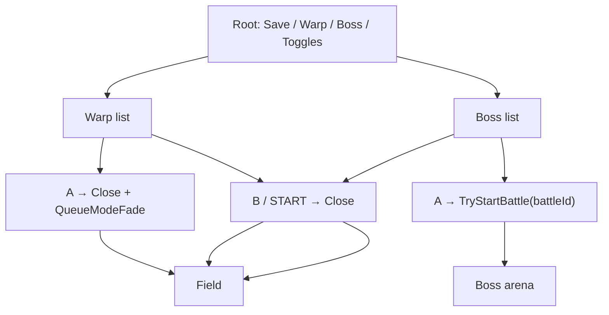

# Overworld Debug Menu

---

## Index

- [Introduction](#introduction)
- [Plan](#plan)
- [Controls](#controls)
- [Warps](#warps)
- [Boss fights](#boss-fights)
- [Display model](#display-model)
- [Engine cooperation](#engine-cooperation)
- [Code Locations](#code-locations)
- [TODO](#todo)
- [Limitations & Bugs](#limitations--bugs)

## Introduction

Vanilla Sigma Star Saga only saves from the status / END panel. This hack adds a **START** overlay on overworld field modes: save anywhere, warp via the NAV table, and jump straight into any midboss or story boss fight.

Enable with `.debug_menu = TRUE` in `configs/runtime.c`.

## Plan

Root options:

1. **Save game** — EEPROM write to the current slot
2. **Warp to scene...** — NAV location list; **A** fades to that mode
3. **Boss fight...** — all 19 `MB_*` midbosses + 10 `B_*` story bosses; **A** starts that fight
4. **No random battles: ON/OFF** — toggles step RNG encounters (lure circles unchanged)
5. **Max health: ON/OFF** — live toggle for `.always_max_health`; pins the flight ship's actor-pool HP (`gActorPool[0]+0x34`, NOT `*gPlayerPtr` — see caveat below) to `FullShipHpForPlayer` and clears the hit flag every frame (not just the hurt *state* — HP itself can no longer drain to a lethal value in stages that read it)
6. **Max bombs: ON/OFF** — live toggle for `.always_max_bombs` (flight smart bombs held at 7)
7. **All items/tools: ON/OFF** — live toggle for `.all_key_items` + `.all_tools`; grants are one-shot OR-writes, so turning this back ON re-applies them but turning it OFF does not revoke items already granted
8. **Enemy HP bars: ON/OFF** — live toggle for `.enemy_hp_bars` (flight HP bars under enemies)

Rows 5–8 are the sole runtime source of truth for their cheat (`DebugToggle_*` in `src_custom/debug_toggles.c`) — seeded once from the matching `RuntimeConfig` field as the menu's starting state, but freely switchable either direction in-game, including turning on a cheat the ROM shipped disabled. The one build-time dependency: `enemy_hp_bars`'s LynJump hook (`DrawActors__Replacement` / `InitActorParams__Replacement`) is only installed in the ROM when `.enemy_hp_bars` **or** `.debug_menu` is TRUE (see `tools/apply_lynjump.py`); with `.debug_menu = TRUE` that's always satisfied, but a debug-menu-less build with `.enemy_hp_bars = FALSE` has no hook to toggle. `always_max_health` / `always_max_bombs` / `all_key_items` / `all_tools` share hooks (`UpdateShooterFrame__Replacement`, `OverworldPlayerUpdate__Replacement`) that are already installed whenever any gun-data unlock is on, which the shipped config always has.

### Ship picker — removed, incident record

A "Ship" row was added and then **removed** after it caused a live regression: the player (Ian Recker) got stuck in an unrecoverable climbing pose. Root cause (confirmed via disassembly + mGBA live probe, see git history for the full investigation):

- The row force-wrote `player+0x22` (called `PLAYER_STAGE_TYPE_OFF` by `FullShipHpForPlayer`, `src_custom/suction_hooks.c`) into `gActorPool[0]` every frame from `UpdateShooterFrame__Replacement`.
- That offset is **not player-exclusive** — `src_custom/overworld_enemy_exp_hooks.c` independently names the same actor-struct offset `ACTOR_OFF_MODEL`, a general model/animation-index field reused by overworld and cutscene actors that also occupy pool slot 0 (`gActorPool[0]` is documented as "flight + cutscenes" — `documentation/ram-map.md`).
- `UpdateShooterFrame`'s call site (vanilla `0x0800D610`) is the same broadly-shared overworld/field main-frame body reached by ~129 of ~256 `gMode` values, not a flight-exclusive path — so the write could land on a non-ship actor's model index.
- A stray value written to that offset during flight was confirmed (live probe) to **persist across a mode transition**, unlike sibling fields that get reinitialized — so it could bleed into whatever actor next occupied slot 0, misread as a bogus animation/model index and produce a stuck pose.
- Toggle-gating alone (`if (index != 0)`) was not sufficient: it stops the *default-off* case, but the write is still unsafe whenever the feature is actually in use, from any mode that reaches that shared call site.
- Separately, HP tiers were never the right feature anyway — no sprite/visual difference was ever found tied to `player+0x22`; it only changes HP stock.

**Do not re-add a ship-type picker by writing this offset.** Any future version needs: (1) a real per-model sprite/ANM selector identified via disassembly — `GetArchiveFileStart__Replacement` in `src_custom/suction_hooks.c` is the existing, confirmed-safe pattern for swapping a specific graphic (used today only for the Phoenix revive popup; the player ship's own ANM file-table index has not yet been identified), and (2) any per-frame apply hook gated on a confirmed real flight `gMode`, not just a toggle-enabled check — see the `gba-ram-address-audit` and `rom-hook-regression-check` skills before writing to any actor-struct offset whose full read/write site set hasn't been enumerated.

It deliberately **never** calls `StatusToggle`, `StatusPanel`, `SetMode(0x168)`, or `LeaveStatusRestore`. `gMode` stays on the overworld value while the menu is open; world sim is paused by LynJumps on the overworld frame, not by changing modes. Warps close the overlay and then `QueueModeFade`; bosses close it and call `TryStartBattle`.

| Screen | Behaviour |
| --- | --- |
| Root | `Save game` / `Warp to scene...` / `Boss fight...` / `No random battles` / `Max health` / `Max bombs` / `All items/tools` / `Enemy HP bars` with UP/DOWN cursor |
| Warp | A opens NAV location list; A again → close overlay → `QueueModeFade(modeId)` |
| Boss | A opens the boss list; A again → `TryStartBattle(battleId)` |



## Controls

| Input | Context | Action |
| --- | --- | --- |
| START | Field (overworld frame) | Open / close menu |
| UP / DOWN | Any list | Move cursor (scrolls when needed) |
| A | Root → Warp / Boss | Enter that submenu |
| A | Root → No random battles / Max health / Max bombs / All items-tools / Enemy HP bars | Flip that toggle on/off |
| A | Warp list | Close menu and `QueueModeFade` to that location's mode ID |
| A | Boss list | Launch the selected boss |
| B | Warp / Boss list | Back to root |

## Warps

Warps use `QueueModeFade` (`0x0800D734`) — same path as StatusToggle: transition latch + fade-to-black + pending mode @ `0x03000D6C`. `FadeStep` applies `gMode` when the fade completes; map prep then runs from `OverworldMainFrame`.

## Boss fights

The roster is the full vanilla set of 29 fights: 19 midbosses (`MB_EYENUS` … `MB_ICEPETALS`) and 10 story bosses (`B_DRILL` … `B_PSYME`).

### Stage labels, not arena packs

The stage-label table @ `0x080ED50C` is 270 entries of `u16 id` + `char name[0x26]` (stride `0x28`), and its index **is** `gStageCase`:

| Label ids | Names |
| --- | --- |
| 0–226 | missions: `TRAINING_MISSION`, `FOREST_1_1`…`FOREST_5_10`, `FIRE_2_1`…, `FORGOT_5_1`…, `ICE_3_1`…`ICE_6_10`, `KRILL_*`, `SAND_4_1`…`SAND_6_10` |
| 227–245 | `MB_*` midbosses |
| 246–255 | `B_*` story bosses |
| 256–269 | `EARTH_*`, `END_GAME_DEATH_THROES`, `ALL_CLEAR`, `ENEMY_TESTER` |

That table is why earlier revisions of this menu dropped the player into ice-planet missions: **135–174 are `ICE_3_1`…`ICE_6_10`**, so `gStageCase = 142` asked for `ICE_3_8`, not a Drill arena. The `setModeId` values that looked like boss labels (246, 247, …) are ids in `SetMode`'s own, larger id space and do not index the label table.

`EnterStageArena`'s jump table @ `0x0802972C` is also indexed by label id, but only five boss labels have their own arena handler — `B_BLUNE` (248), `B_LAVAWORM` (249), `B_MEATHEAD` (250), `B_SEVENSPINE` (253), `B_PSYME` (255). The other 24 land on the shared epilogue `0x0802AD50`, which issues no `SetMode` at all, so poking `gStageCase` can never reach them.

### Launching through the battle record

Every boss instead owns a battle record whose **id equals its label id**, in the battle table @ `0x0824EE80` (count @ `0x080ED014`, 297 records). Starting one is the same call the overworld lure objects make, so the record's own command list picks the arena and spawns the boss:

```c
gStageClearFlag = 0;
gStageClearGate = 0;
DebugMenu_Close();
TryStartBattle(entry->battleId); /* 227..255 */
```

Record layout (20 bytes, from `TryStartBattle` @ `0x08014828` / `StartBattle` @ `0x08018C38`):

| Offset | Field |
| --- | --- |
| `+0` | `s32` battle id |
| `+4` / `+8` | intro command count / pointer |
| `+12` / `+16` | wave command count / pointer |

Commands are 88-byte structs with a `u32` opcode at `+0` dispatched through the 18-entry table @ `0x0801870C`. Opcode 9 is the flight entry: `StartBattle` checks `intro[0].op == 9` and calls `ChangeMode(0x9B)`.

### Planet grouping

No ROM table links a boss to a planet. The label table groups missions by **chapter** (1–6), and chapters are shared across planets — `FOREST` spans chapters 1–5, `FIRE` 2–6, `ICE` 3–6, `SAND` 4–6, `FORGOT` 5–6, `KRILL` 6. Each planet's *own* chapter is therefore the first one its missions appear in, which matches the game's six chapters / six planets structure.

Story boss placements come from that plus the walkthrough boss order; midboss placements are thematic and provisional.

| Planet (chapter) | Midbosses | Story bosses |
| --- | --- | --- |
| Forest (1) | Greenone 232, Greenturkey 234, Vulturehead 229, Flower 239 | Drill 246, Blune 248 |
| Fire (2) | Tetrill 231, Centi 237 | Lavaworm 249 |
| Ice (3) | Flice 228, Silverfish 242, Icepetals 245 | Sevenspine 253 |
| Sand (4) | Crab 236, Viper 241, Gunorbship 244 | Concentrator 247 |
| Forgotten (5) | Eyenus 227, Boogey 230, Innereye 233, Doppelganger 235, Sothoth 243 | Spectrodactyl 252 |
| Krill / finale (6) | Helper 238, Cerebellum 240 | Battleworm 251, Rrrobot 254, Psyme 255, Meathead 250 |

Anchors behind those placements:

| Boss | Evidence |
| --- | --- |
| `B_DRILL` | chapter 1 boss ("The Big Drill") |
| `B_LAVAWORM` | chapter 2 boss, the worm that spits lava and magma balls |
| `B_SEVENSPINE` | arena renders as the ice field (probe screenshot) |
| `B_CONCENTRATOR` | chapter 4 boss |
| `B_BLUNE` | chapter 3 sends the player back to the Forest planet to kill Blune |
| `B_SPECTRODACTYL` | chapter 5 "Ghost of Iot" on the haunted planet |
| `B_MEATHEAD` | final boss — giant face, background holes, tentacles, eye beam |
| `B_RRROBOT` | chapter 3 Sigma fleet assault ("Robotech wanna-be") |
| `B_PSYME` | chapter 6 Battleworm rematch, flown by Psyme |
| `MB_FLOWER` | Forest planet flying-flower midboss |
| `MB_GUNORBSHIP` | Sand planet twin-orbiting-shield midboss |
| `MB_DOPPELGANGER` | Forgotten planet fighter that mirrors the player |

## Display model

While open:

| Layer | Setup | Role |
|-------|--------|------|
| BG0 | CB2 / SB30, pal bank 15 | Option list / `Saving…` / `Saved!` |
| BG1 | CB2 / SB31, blank tile 0 | Solid black fill |
| BG2–BG3 / OBJ | Off via `gDisplayCtrlMirror` | Hide world + HUD |

Text is written **directly** into VRAM screenbase 30. Soft-text (`ClearSoftTextMap` / `DrawDebugText`) is avoided: those set `gSoftTextDirty`, and VBlank then DMA-reloads soft maps every frame and fights the overlay.

Repaints only run when `gDebugMenuTextState` changes (cursor moves force `DBG_TEXT_NONE`), and they wait on VBlank first.

## Engine cooperation

Two engine paths still run every frame from the main-loop epilogue @ `0x0800BB00`, **outside** both LynJump sites. Pausing the overworld frame body does not stop them:

| Path | Address / symbol | What the menu does |
|------|------------------|--------------------|
| `HudSync(1)` | `0x08010E58`, called from `0x0800BB98` | Rebuilds HUD tilemap unless `gHudEnabled == 0` |
| Status DISPCNT mirror | `gDisplayCtrlMirror` @ `0x03007194` | Re-applied to `REG_DISPCNT` every frame; menu drives this mirror, not hardware alone |

On close, restore cameras, VRAM snapshot, DISPCNT mirrors, and soft-text dirty bits as documented in prior revisions.

## Code Locations

| Feature | Location | Description |
|---------|----------|-------------|
| Runtime toggle | `.debug_menu` in `configs/runtime.c` | Enables LynJumps + menu logic |
| Menu body | `DebugMenu_*` in `src_custom/debug_menu_hooks.c` | Open / present / save / warp / boss / close |
| Public API | `DebugMenu_IsBlocking` / `DebugMenu_OnOverworldFrame` in `include/debug_menu.h` | Gate + per-frame entry |
| Mode thunks | `ChangeMode` / `QueueModeFade` in `include/status.h` | Warp entry |
| Battle entry | `TryStartBattle` in `include/overworld_encounters.h` | Boss entry |
| Random battle gate | `RandomBattlesSetDisabled` / `gDebugMenuToggleRandomBattlesOff` (EWRAM) in `src_custom/random_battle_hooks.c` | Debug menu toggle; does not touch vanilla `gRandomBattleCooldown`, nor the engine's encounter selector `0x03007680` |
| Random battle hook | `TryStartRandomBattle__Replacement` in `src_custom/random_battle_hooks.c` | LynJump gate @ `0x1DA5C` |
| Cheat toggles | `DebugToggle_*` / `gDebugMenuToggle{MaxHealth,MaxBombs,AllItems,HpBars}Off` (EWRAM) in `src_custom/debug_toggles.c` | Live overrides for `.always_max_health`, `.always_max_bombs`, `.all_key_items`/`.all_tools`, `.enemy_hp_bars`; consumed in `src_custom/flight_skip_hooks.c` and `src_custom/enemy_hp_bar_hooks.c` |
| Boss table | `sDebugBosses` in `src_custom/debug_menu_hooks.c` | Name + battle id (227–255) |
| Arena selector | `gStageCase` in `asm/ram_map_iwram.s` | Dig arena case for host mode 132 |
| Boss probe | `tools/mgba_boss_probe.c` | Replays boss rows; sweeps `gStageCase` |

## TODO

- [x] More menu entries (flags, item grants) behind the same overlay — max health, max bombs, all items/tools, enemy HP bars
- [ ] Ship picker row — reverted after causing a stuck-pose regression; needs a real sprite/ANM selector (see "Ship picker — removed, incident record" above) before re-attempting
- [ ] Pin full BG palette bank 15 so text color does not inherit field leftovers
- [ ] Drop temporary `DEBUG_MENU_LOG` / No$ prints once the overlay is considered stable
- [ ] Optional non-blocking save (today `WriteSave` freezes the CPU for ~20 frames on EEPROM)
- [ ] Friendlier warp labels and optional raw ID pickers
- [ ] Confirm the provisional midboss planet placements in-game (story bosses are anchored; midbosses are thematic guesses)
- [ ] Re-verify the 29 rows in `tools/mgba_bossbattle_probe.c`. Its boot drive lands on `gStageCase = 269` (`ENEMY_TESTER`) with a black frame, so its blank/working verdicts are not trustworthy — it needs a savestate taken in a real overworld field.
- [ ] Fix the 1-2 frame full-brightness flash of the live field on every warp/boss launch before the fade covers it (see Limitations & Bugs below for root cause and the fixes already tried and reverted).
- [x] Full 29-row roster (19 `MB_*` + 10 `B_*`) launched via `TryStartBattle`
- [x] Fade-out before warp via `QueueModeFade` (StatusToggle path)

## Limitations & Bugs

- Opens only on a real walkable field mode: `gMode` in `0x04`-`0x09` or `0x0F`-`0x17` (the NAV planets / starbases) **and** whose main-loop JT slot points at `OverworldMainFrame` (`0x0800D610`). The JT test alone is not sufficient — 129 mode slots share that handler, including the status panel (`0x8F`) and the 2D flight stages (`0x84` / `0x97`). Opening the overlay there reprogrammed `BG0`/`BG1`/`DISPCNT` to `0x1E08` / `0x1F0B` / `0x0300` over a screen that never restores them, giving a black screen with the menu music still playing.
- Save uses the **current** `gSaveSlot`. There is no in-menu slot picker yet.
- Warp uses `QueueModeFade` (fade then pending `gMode`); spawn position / facing come from whatever the destination mode's prep uses (not a full door-record teleport).
- The overlay hides OBJ through `DISPCNT`; it must not clear `gSoftOam`.
  That shadow contains persistent effect records needed by the random-encounter
  ship summon. Clearing it stranded the player in state `0x36`, with the
  encounter armed but mode `0x84` never starting.
- **Every warp and boss launch flashes 1-2 full-brightness frames of the live field before the fade-to-black covers it** (confirmed via mGBA headless probe: measured frame brightness stayed at the pre-warp level for 2 frames after the confirming A-press, only starting to dim on the 3rd). Root cause: `DebugMenu_Close()` restores `REG_DISPCNT`/camera state and makes the world visible again in the same frame `QueueModeFade` is called, but `FadeStart` (called by `QueueModeFade`) only arms the fade — the darkening ramp is applied gradually by `FadeStep` (@ `0x080042E1`). **Important correction from an earlier pass at this**: `FadeStep` is not called from a free-running main-loop epilogue — it is called from *inside* `OverworldMainFrame`'s own body, at offset `+0x44` (i.e. `0x0800D654`), which is exactly the code `OverworldMainFrame__Replacement` skips for as long as `DebugMenu_IsBlocking()` reads true. So `FadeStep` cannot tick at all while the overlay is blocking the frame — extending the blocked window (tried: one/two/three extra frames holding `gDebugMenuActive` in a not-yet-closed state before calling `DebugMenu_Close()`) does not give it more chances to run, it gives it *fewer*, and just relocates the same flash later by exactly as many frames as were added, confirmed by measurement each time. Vanilla's own `QueueModeFade` callers (`StatusToggle` et al.) never show this flash because the world was already on screen and unblocked the frame before the call — there is no reveal to synchronize with a blocked `FadeStep`.
  Tried and reverted (all four): (1) forcing `REG_BLDCNT`/`REG_BLDY` to a full-dark value after `QueueModeFade` — overwritten by `FadeStep`'s own computation the moment it next runs; (2) pre-loading the fade's ramp accumulator (`0x030038A8`, added into by `FADE_SPEED_A` @ `0x03000CE8` each tick, clamped at `0x1F00`) to its max, written after `QueueModeFade` so `FadeStart` doesn't reset it back to 0 — this makes `FadeStep`'s *first* tick see the accumulator already at/over the clamp and take its "fade complete" branch (the same one that applies the pending `gMode`) immediately, so `gMode` was observed flipping one frame after the confirming A-press instead of the vanilla ~5-frame fade — not a real fade, just a faster jump-cut, and the reveal frame right before that jump is still measured at full brightness; (3) that same accumulator preload plus manually calling `FadeStep()` once more to force an immediate recompute — **do not do this**: it is the same premature "fade complete" branch as (2), risking the mode switch firing a frame early; (4) holding the overlay open for 1-3 extra "blocked" frames (a `DBG_CLOSING`/`DBG_CLOSING_ARMED`/`DBG_CLOSING_HOLD` state chain) before calling `DebugMenu_Close()` — since blocking is exactly what stops `FadeStep` from running (see correction above), this only delays the identical flash by as many frames as were added; measured `gMode` not flipping at all even 3 frames after arming, versus 1 frame in the unmodified baseline.
  A correct fix needs the field to stay visually hidden for at least one frame *after* unblocking (so the real `FadeStep` inside `OverworldMainFrame`'s body gets to run against a freshly-armed, not-pre-loaded fade), without touching the fade's own accumulator/completion logic. The most promising untried direction: keep the overlay's BG1 black fill enabled via `gDisplayCtrlMirror` (not the blend registers) for one frame after `DebugMenu_Close()` unblocks, then let it clear — but this needs to survive the "status/HUD display module re-applies `gDisplayCtrlMirror` to `REG_DISPCNT` every frame" behavior already documented above, which was not verified to cooperate before this investigation ran out of runway. Left unfixed pending that.
- **Max health does not prevent death in the Ch.1-opener flight stage** (`gMode 0x84` reached via `CutsceneCh1Opener`, `.custom_cutscene_ch1`). Confirmed via mGBA live probe with a fresh boot (title → START → A → A → play the intro flight for real, no `skip_flight_battle`): `gPlayerPtr`'s target read all-zero for 3600+ frames of active combat while `gActorPool[0]` (the real ship — see `ram_map.h` "flight `[0]`=ship") visibly moved every frame, so the old `actor == gPlayerPtr` veto in `DamageApply__Replacement` was dead code for the player and has been fixed to `index == 0`; `ApplyMaxHealth()` was switched from `gPlayerPtr` to `&gActorPool[0]` to match. Both are verified live (A/B mGBA test: `gActorPool[0]+0x34` pinned at `FullShipHpForPlayer()` every frame with the toggle on, `0` throughout with it off). **However**, in this specific stage `gActorPool[0]+0x34` never carried the real HP even before the fix: a full IWRAM+EWRAM diff across six independent, screenshot-confirmed hits (HUD HP bar visibly shrinking, tracked via a tight on-screen pixel crop) found no RAM byte anywhere that survived intersection except two `gSoftOam` shadow-table bytes (attr1 X-position of whichever OAM slots the bar's sprites happened to occupy that frame) — and those slot indices were observed to shift as other actors spawned, so they are not a stable pin target. The bar in this stage is animated directly from OAM geometry with no separate scalar HP counter found; the fixed code is now provably correct (veto reaches the real actor, matches the documented `overworld_enemy_exp_hooks.c` convention) but a control run with the toggle forced on via direct EWRAM write still died at the identical frame (10295) as the toggle-off control, confirming this stage's death trigger is untouched by the fix. Not investigated: whether `gPlayerPtr` is live (and `player+0x34` therefore real) in boss fights or other flight-stage variants reached via `TryStartBattle`/NAV warps — vanilla `PlayerHitUpdate` (`0x08024E24`, disassembly-confirmed) does dereference `*gPlayerPtr` and write `0xFF` to `+0x34` on its lethal branch, so the mechanism is real for *some* stage type; only the Ch.1 opener was reachable and tested within this pass. If Max Health is later reported broken in a specific mission/boss, check whether that stage's `gPlayerPtr` is populated before assuming the same OAM-only mechanism applies there.
  - **Follow-up, a different flight-stage variant (not the Ch.1 opener), confirmed via a real user-provided mGBA savestate**: this stage type *does* have a real, working numeric HP field — `gActorPool[0]+0x34` reads `5` (matches `FullShipHpForPlayer`), and an A/B replay from the same savestate (toggle forced OFF vs. left ON) showed identical play through frame 2421, where HP genuinely drops `5→0` with the toggle off and the fix correctly restores it to `5` on-frame with the toggle on — so the HP-pin mechanism is real and working in this stage. **However the ship still dies and reaches the GAME OVER screen in both cases.** Brute-force pinning `gActorPool[0]+0x34 = 5` on literally every frame (bypassing all hook logic) did not stop it either. Root cause found by bisecting frame-by-frame: at frame 2295 — 124 frames *before* `gMode` itself visibly changes — `gActorPool[0]`'s state byte flips `29→0` and `gPendingMode` (`0x03000D6C`) gets written to `0x98` (game-over) in that same frame, both independent of the HP field, which was untouched at that moment. This is a separate "instant death" signal from whatever specific attack landed the hit; the normal HP-drain path this section's main fix addresses is a different code path. A `QueueModeFade__Replacement` veto (`src_custom/flight_skip_hooks.c` + `tools/apply_lynjump.py`'s `apply_queue_mode_fade_hook`, blocking `QueueModeFade(0x98, …)` while the toggle is on) was added on the theory that the death path routes through `QueueModeFade` like every other mode transition in this codebase — confirmed installed correctly at the binary level (veneer bytes decoded, redirect address correct) — but replaying the same savestate with this veto in place **still reached GAME OVER**, so either this specific kill path writes `gPendingMode` through a different route that doesn't call `QueueModeFade` at all, or the veto has a bug not yet found. A second attempt to re-bisect the exact decision frame to confirm which produced inconsistent frame numbers between probe runs (see the frame-drift gotcha in the `mgba-headless-probe` skill) and was not resolved before this pass ended. **Status: the `QueueModeFade` veto is left in the tree (low-risk — it only ever blocks mode `0x98` while Max Health is on, every other transition is unaffected) but is unverified against this specific instant-death case.** Next investigator: use `.claude/skills/gba-causal-trace-hunt` and re-derive the exact decision frame fresh in a single probe run rather than reusing a frame number from a prior run/build.
- Midboss planet labels are provisional; the story boss labels are anchored to chapter order and arena screenshots.
- Boss rows arm a vanilla battle from wherever the player is standing. A fight whose record expects story state (a specific chapter or planet) can still behave oddly; `MB_ICEPETALS` for one runs a chapter transition.
- With `.skip_flight_battle` on, **SELECT+L** still force-clears an in-progress flight stage.
- Do not gate the overlay on `0x030002D5`. Although `Helper_2CD40` writes it and `0x0802C81C` consumes it while preparing movement input, runtime checks show that it is not a stable field-vs-cutscene discriminator across maps and save paths; either polarity can permanently block START during ordinary play. Cutscene safety instead relies on the strict walkable-mode allowlist, which rejects the known hazardous Ch.1 opener (`0x84`), plus the live-conversation check.
- The overlay must **never** be closed on a stalled `gOverworldFrameCounter` (`0x03003688`). A watchdog that did so was added and reverted: blocking the vanilla body is exactly how the overlay pauses the world, so that counter is frozen for as long as the menu is open by design. The watchdog therefore fired on every ordinary use and force-closed the menu after ~1.7 s on every field map.

Report save/restore/warp/boss glitches with the field `gMode`, destination / battle ID, whether `.debug_menu` was on, and a screenshot of the open and closed frames.
