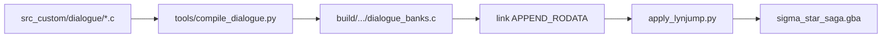

# Dialogue Scripts

---

## Index

- [Introduction](#introduction)
- [Plan](#plan)
- [Code Locations](#code-locations)
- [TODO](#todo)
- [Limitations & Bugs](#limitations--bugs)

## Introduction

Story and NPC talk text lives as a packed `#`-delimited bytecode stream in `baserom.gba`. The game indexes it at boot from **7 bank base pointers** (`0x24EA6C`) and a script-ID range table (`0x5BF3C`, ids **0–464**).

This feature:

1. Dumps vanilla banks to [`data/dialogue/`](../../data/dialogue/) (reference only).
2. Keeps an editable copy at [`src_custom/dialogue/`](../../src_custom/dialogue/).
3. Compiles those macros into appended ROM banks and redirects the bank table so edits appear in-game when `custom_dialogue` is enabled.

Pattern matches [ygodm8](https://github.com/JesterWizard/ygodm8)-style “author macros → compile → patch pointers,” with the patch surface being the **bank table** rather than per-scene LynJump hooks.

## Plan

### In-game authoring flow

| Step | Action |
|------|--------|
| 1 | Edit `src_custom/dialogue/chapter_*/scene_*.c` |
| 2 | Keep `.custom_dialogue = TRUE` in [`configs/runtime.c`](../../configs/runtime.c) |
| 3 | Run `make` |
| 4 | Play `sigma_star_saga.gba` — talk uses your banks |

Set `custom_dialogue = FALSE` to keep vanilla talk banks (no pointer redirect).

### Talk stream model

| Item | Value |
|------|--------|
| Bank pointer table | 7× ROM ptr @ file `0x24EA6C` |
| Script-ID ranges | 7× `(lo, hi)` u32 @ `0x5BF3C` (ids 0–464) |
| Bank terminator | `#~\x00` |
| Entry delimiter | `#` |
| Talk header | `\x07 <speaker_id> </> <expr> \x07` then text |
| Page / box end | `\x0c` (one C string arg per page) |
| Portrait side | `<` → `SIDE_LEFT`, `>` → `SIDE_RIGHT` |

### Chapter folders (7 banks)

| Folder | Vanilla ROM range | Script IDs |
|--------|-------------------|------------|
| `chapter_00_system/` | `0x5BF74`–`0x5C9E1` | 0–50 |
| `chapter_01/` | `0x5C9E1`–`0x62695` | 51–135 |
| `chapter_02/` | `0x62695`–`0x66A9A` | 136–191 |
| `chapter_03/` | `0x66A9A`–`0x6D0DC` | 192–305 |
| `chapter_04/` | `0x6D0DC`–`0x72319` | 306–381 |
| `chapter_05/` | `0x72319`–`0x74F26` | 382–422 |
| `chapter_06/` | `0x74F26`–`~0x781E3` | 423–464 |

Each `scene_XXXXXX.c` is one `#` entry (`XXXXXX` = vanilla file offset). `EMPTY()` stubs are kept so script IDs stay aligned.

### Authoring macros

| Macro | Meaning |
|-------|---------|
| `DIALOGUE_SCRIPT(rom_addr, name)` / `END_DIALOGUE_SCRIPT()` | Scene wrapper (vanilla address is documentary) |
| `TALK(speaker, side, expr, "page", …)` | Portrait line; one string per page |
| `TEXT("…")` | System / UI line (no talk header) |
| `CHAPTER_TITLE("…")` | Chapter title card |
| `EMPTY()` | Empty `#` stub that still consumes a script ID |

### Build pipeline



When `custom_dialogue` is TRUE, the patcher writes `gDialogueBank0..6` into `0x24EA6C` and refreshes the ID range table at `0x5BF3C`.

### Regenerate vanilla dump

```bash
python3 tools/extract_dialogue.py
```

Refresh the editable copy (destroys local edits):

```bash
rm -rf src_custom/dialogue
cp -a data/dialogue src_custom/dialogue
```

## Code Locations

| Feature | Location | Description |
|--------|----------|-------------|
| Editable scenes | [`src_custom/dialogue/`](../../src_custom/dialogue/) | Author these; compiled into the ROM |
| Vanilla dump | [`data/dialogue/`](../../data/dialogue/) | Regenerable reference only |
| Extractor | [`tools/extract_dialogue.py`](../../tools/extract_dialogue.py) | Dump baserom → `data/dialogue/` |
| Compiler | [`tools/compile_dialogue.py`](../../tools/compile_dialogue.py) | Macros → `gDialogueBank*` blobs |
| Bank redirect | `apply_custom_dialogue` in [`tools/apply_lynjump.py`](../../tools/apply_lynjump.py) | Patch `0x24EA6C` + `0x5BF3C` |
| Toggle | `.custom_dialogue` in [`configs/runtime.c`](../../configs/runtime.c) | Enable / disable custom banks |
| Macros | [`include/dialogue_macros.h`](../../include/dialogue_macros.h) | `TALK` / `TEXT` / `EMPTY` / … |
| Speakers | [`include/constants/dialogue_speakers.h`](../../include/constants/dialogue_speakers.h) | `SPEAKER_*` ids |
| Make rules | [`Makefile`](../../Makefile) | `dialogue_banks.c` → `.o` → link |

## TODO

- [ ] Confirm speaker id ↔ portrait frame mapping against in-game talk UI
- [ ] Map scenes to overworld map / state / NPC once event RE exists
- [ ] Scene editor UI over `src_custom/dialogue/` (ygodm8-style workflow)
- [ ] Safer handling when adding/removing scenes (auto-shift call sites / ID tables)

## Limitations & Bugs

- **Do not reorder or delete scenes** casually — script IDs are positional within each bank. Adding/removing entries shifts later IDs and can desync in-game triggers unless you also update callers / ranges.
- Length may grow freely (banks live in append ROM); keep `#` counts stable unless you intend to retarget IDs.
- Chapters 2 and 5 have no in-stream title string; folder numbers follow the pointer table.
- `EXPR_ALT` is only a label for expression byte `1`.
- Speaker names are provisional until RE confirms portrait wiring.
- Round-trip is not byte-identical to vanilla (e.g. stray `?` after some `\x0c`); gameplay uses the compiled banks.

Report dump/compile issues with the scene ROM offset from the file header comment (`0x08……`).
