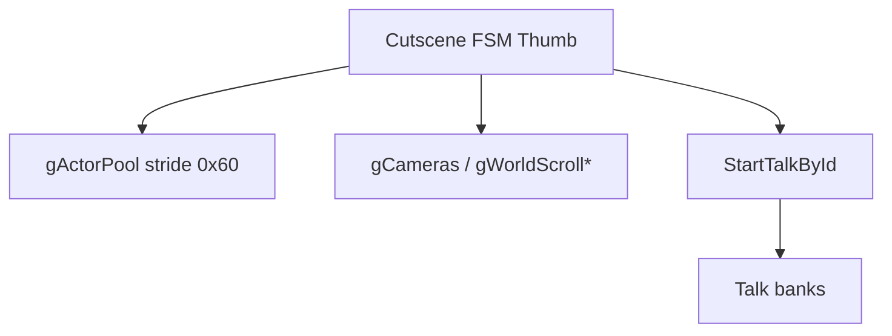

# Overworld Events & Cutscenes

---

## Index

- [Introduction](#introduction)
- [Plan](#plan)
- [Code Locations](#code-locations)
- [TODO](#todo)
- [Limitations & Bugs](#limitations--bugs)

## Introduction

Talk text is already editable via [`documentation/dialogue/`](../dialogue/). Sprite **entrance / exit / movement** for cutscenes is **not** driven by that talk stream.

Unlike [ygodm8](https://github.com/JesterWizard/ygodm8) (bytecode `EVENT_SCRIPT` + `MOVE_OBJECT` / `WALK_OBJECT_*`), Sigma Star Saga stages sprites with **hardcoded Thumb state machines**: per-frame step counters, jump tables, and linear “beat” call chains that poke `gActorPool` / camera / scroll RAM and occasionally call `StartTalkById`.

Goal of this track: reverse those entrypoints well enough to author movement as macros (and later a scene editor), then replace vanilla cutscene functions via LynJump — without inventing a fake bytecode VM up front.

## Plan

### Architecture (current understanding)

| Layer | Role | Editable today? |
|-------|------|-----------------|
| Talk banks | Portrait lines / UI text (`#` stream) | Yes — `src_custom/dialogue/` |
| Cutscene FSMs | Step / jump-table Thumb that moves actors + calls talk | No — still in `baserom` |
| Overworld map objects | 16-byte records via `gMapObjBasePtr` (walk / encounter) | Partial RE only |
| Story flags | `GetFlag` / `SetFlag` on `gEventFlags` | Known helpers |

### Talk helpers (confirmed)

| Symbol (provisional) | ROM | Signature / notes |
|----------------------|-----|-------------------|
| `InitTalkBanks` | `0x080109A0` | Copies 7 bank ptrs from `0x0824EA6C` → `gDialogueBankBases`; builds offsets |
| `BuildTalkOffsets` | `0x08010964` | Scans `#` → `gDialogueEntryOffsets` halfwords |
| `StartTalkById` | `0x080108B0` | `(u16 scriptId, u8 a, u8 b)` — bank lookup via `0x0805BF3C` ranges |
| `StartTalkPtr` | `0x08010808` | `(const u8 *stream, u8 a, u8 b)` — arms talk UI |
| `GetFlag` / `SetFlag` / `ClearFlag` | `0x080117EC` / `0x0801177C` / `0x080117B4` | Bit ops on `gEventFlags` |

`StartTalkById` has **17** BL call sites. Common trailing args are `(…, 4, 3)` (layout / UI mode — not speaker side; side lives in the talk header).

### `StartTalkById` catalog

| Call site | Script ID | Scene | Owner |
|-----------|-----------|-------|-------|
| `0x0800D3FA` | 455 | `chapter_06/scene_07724F` | Map interact path |
| `0x08010950` | — | (passthrough) | Inside `StartTalkByIdEx` |
| `0x08017A32` | **variable** | most NPC / map talks | Event-record walker @ `0x080179C8` (ops `0x22` / `0x26` → script id) |
| `0x0801C18A` | 6 | `chapter_00_system/scene_05C005` | Beat chain ~`0x0801BE74` |
| `0x0801CA0A` | 0 | `chapter_00_system/scene_05BF74` | Beat chain ~`0x0801BE74` |
| `0x08025514` | 8 | `chapter_00_system/scene_05C035` | JT FSM @ `0x08025394` |
| `0x08025772` | 8 | same | same region |
| `0x080257C8` | 9 | `chapter_00_system/scene_05C05B` | same region |
| `0x0802B648` | 451 | `chapter_06/scene_077047` | Stage FSM @ `0x0802B18C` |
| `0x0802BFC6` | **109** | `chapter_01/scene_0605BB` | Stage FSM case @ `0x0802BFA0` |
| `0x08049552` | 375 | `chapter_04/scene_071E72` | FSM @ `0x08049454` |
| `0x08049E3E` | 409 | `chapter_05/scene_0741AA` | — |
| `0x08049F8C` | 205 | `chapter_03/scene_067DF7` | — |
| `0x0804D37C` | 453 | `chapter_06/scene_077146` | — |
| `0x0804D9F0` | 226 | `chapter_03/scene_068E30` | — |
| `0x0804EA64` | 150 | `chapter_02/scene_0632E9` | — |
| `0x0805265A` | **51** | `chapter_01/scene_05C9E1` | `CutsceneCh1Opener` @ `0x080523EC` |

**Chapter 1 takeaway:** of 85 bank-1 scripts (ids 51–135), only **51** and **109** are hardcoded cutscene talks. The rest (including long briefings like `scene_05D06C` / id 67) are map/NPC talks via `0x080179C8` — **no sprite FSM to peel**.

### Worked example — Chapter 1 opener + script 51

| Item | Value |
|------|--------|
| Dialogue | `scene_05C9E1` / script ID **51** (first bank-1 entry @ `0x5C9E1`) |
| Call site | `StartTalkById(51, 4, 3)` @ `0x0805265A` |
| Owner FSM | `0x080523EC` (push `{r4–r7,lr}`) |
| Step RAM | `gCutsceneStep` (`0x03007704`) — stores steps `5`, `10`, `11`, `12`, … |
| Motion | Adds fixed-point deltas to `gWorldScroll*` and `gCameras` (+`0x2C`); walks `gActorPool` slots (stride `0x60`, flag halfword @ `+0x18`, pos @ `+0x28`) |

So the talk line the user edits in `scene_05C9E1.c` is **triggered by this FSM**, not the other way around. Entrance / camera / actor slides for that beat live in the Thumb around `0x080523EC`, not in the dialogue macros.

### Actor fields used by cutscenes

Cutscenes walk `gActorPool` (stride `0x60`, `ACTOR_COUNT` = 0x28). Common pattern: cursor at `actor + ACTOR_OFF_FLAGS` (`+0x18`), then relative stores.

| Offset (from actor base) | Symbol | Cutscene use |
|--------------------------|--------|--------------|
| `+0x18` | `ACTOR_OFF_FLAGS` | `u16` flags; test `ACTOR_FLAG_ACTIVE` (`0x8000`) before nudging |
| `+0x40` | `ACTOR_OFF_X` | World X (16.16). Cutscenes write via `flags+0x28` |
| `+0x48` | `ACTOR_OFF_VX` / `ACTOR_OFF_CUT_Y` | Flight velocity X; `MOVE_FLYING_ACTORS_XY` also bumps slots 10–19 here |
| `+0x4C` | `ACTOR_OFF_Y` | Combat / draw world Y (16.16) |
| `+0x54` | `ACTOR_OFF_VY` | Flight velocity Y (16.16) |
| `+0x01` | `ACTOR_OFF_CAMERA` | Camera index for draw |
| `+0x20` | `ACTOR_OFF_ANIM` | Type id at spawn (`SpawnActor` r2) |

Visibility for cutscene motion = **active flag only**. `SHOW_ACTOR` / `HIDE_ACTOR` OR/clear `0x8000`; `DELETE_ACTOR` calls full `DeleteActor` (frees gfx). Ch.1 stage setup @ `0x08053B34` spawns via `SpawnActor` (`0x08006178`).

### Actor show / hide / walk macros (Ch.1)

| Macro | Backend | Notes |
|-------|---------|--------|
| `SHOW_ACTOR(i, x, y)` / `HIDE_ACTOR(i)` | Soft ACTIVE bit + place | `x,y` are u16 world units |
| `MOVE_ACTOR(i, x, y)` | Absolute place | Same units as `SPAWN_ACTOR` |
| `DELETE_ACTOR(i)` | [`DeleteActor`](../../src/actor_spawn.c) @ `0x08006310` | Full remove |
| `SPAWN_ACTOR(cam, anim, type, x, y)` | [`SpawnActor`](../../src/actor_spawn.c) @ `0x08006178` | Defaults flags `0xA102` |
| `WALK_ACTOR(i, x, y, speed)` | Sets VX/VY toward `(x,y)` | Prefer over cardinal-only |
| `SET_ACTOR_VEL_X/Y(i, v)` | `+0x48` / `+0x54` | 16.16 |

Camera slots (`gCameras`, stride `0x84`): opener writes `+0x2C` / `+0x30` / `+0x34` and the multi-slot trailer at `+0xB0` / `+0xB4` / `+0x134` / …

### Other cutscene shapes

1. **Linear beat chain** (~`0x0801CA00`): successive `BL` to jump-table FSMs (`0x0802236C`, `0x08022778`, …) interleaved with a shared continue/wait helper (~`0x0801D440` epilogue region).
2. **Jump-table FSM** (e.g. `0x0802236C`, `0x08025394`): reads a step byte from a struct (`+8`), indexes a ROM pointer table, `mov pc, r0`.
3. **Flag-heavy map logic** (~`0x08012200+`): dense `GetFlag` / destination picks — warp / state routing, not sprite choreography.

### Intended authoring path (later)

1. Decompile talk helpers + one reference cutscene FSM into `src/` (peel).
2. Introduce `events/scripts/` macros that compile to **replacement FSMs** (or data tables consumed by a small custom runner) — ygodm8-like surface API (`LOAD_SPRITE` / `MOVE_OBJECT` / `WALK_*` / `TALK(id)`), SSS-shaped backend.
3. LynJump the vanilla FSM entry (`0x080523EC`, beat functions, …) when `custom_events` is on.
4. Scene editor edits event scripts + linked dialogue IDs.

Do **not** extend `dialogue_macros.h` with movement opcodes — the talk bytecode has no room for them.

## Code Locations

| Feature | Location | Description |
|--------|----------|-------------|
| Talk banks / macros | [`documentation/dialogue/`](../dialogue/), [`src_custom/dialogue/`](../../src_custom/dialogue/) | Text only |
| Bank / ID tables | ROM `0x24EA6C`, `0x5BF3C` | 7 banks, ids 0–464 |
| `StartTalkById` | [`StartTalkById`](../../src/dialogue.c) @ ROM `0x080108B0` | Script-ID → stream → talk UI (decomp in append) |
| Ch.1 opener FSM | [`CutsceneCh1Opener`](../../src/cutscene_ch1.c) @ ROM `0x080523EC` | Steps + scroll/actor motion; talks id 51 (decomp in append) |
| Stage FSM | [`CutsceneStageUpdate`](../../src/cutscene_stage.c) @ ROM `0x0802B18C` | Outer `gStageCase` dispatcher; talks 109 / 451 |
| Target brief case | [`CutsceneCh1TargetBrief`](../../src/cutscene_ch1.c) @ label `0x0802BFA0` | JT case 0 of stage FSM |
| Map/NPC talk walker | ROM `0x080179C8` | Variable script id from event records → `StartTalkById` |
| Event compiler | [`tools/compile_events.py`](../../tools/compile_events.py) | EVENT_SCRIPT → JSON + opcode tables |
| Event runner | [`src_custom/event_runner_hooks.c`](../../src_custom/event_runner_hooks.c) | Interprets tables; `.custom_event_runner` |
| Event script tree | [`events/scripts/`](../../events/scripts/) | Cutscene wrappers + README |
| Scene editor | [`tools/scene_editor/`](../../tools/scene_editor/) | HTTP UI read/write dialogue scenes |
| Beat chain sample | ROM `0x0801CA00` | Sequential cutscene beats |
| Jump-table sample | ROM `0x0802236C` | Case dispatch on struct+8 |
| Actor pool | `gActorPool` @ `0x03002780` | Stride `0x60`; cutscenes + flight |
| Spawn / delete | [`actor_spawn.c`](../../src/actor_spawn.c) | `SpawnActor` @ `0x08006178`, `DeleteActor` @ `0x08006310` |
| Cutscene step | `gCutsceneStep` / `gCutsceneParam` | `0x03007704` / `0x03007708` |
| Scroll | `gWorldScrollX` / `Y` | `0x03000C44` / `0x03000C6C` |
| Map objects | `gMapObjBasePtr` | Separate 16-byte overworld records |
| Flags | `gEventFlags` + Get/Set/Clear | Story gating |
| Talk decomp header | [`include/dialogue.h`](../../include/dialogue.h) | Prototypes + ROM table macros |
| Ch.1 decomp header | [`include/cutscene_ch1.h`](../../include/cutscene_ch1.h) | `CutsceneCh1Opener` |
| Event authoring macros | [`include/event_macros.h`](../../include/event_macros.h) | ygodm8-style stubs (Ch.1 vocabulary) |
| Reference scene | [`scene_05C9E1.c`](../../src_custom/dialogue/chapter_01/scene_05C9E1.c) | EVENT_SCRIPT + TALK for opener |
| All talk scenes | [`src_custom/dialogue/`](../../src_custom/dialogue/) | `EVENT_SCRIPT_REPLACEMENT` wrappers (map talks = TALK/`END` only; cutscene IDs annotated) |

## TODO

- [x] Decompile `InitTalkBanks` / `StartTalkById` / `StartTalkPtr` into `src/`
- [x] Decompile Chapter 1 opener FSM (`0x080523EC`) as the reference movement peel
- [x] LynJump Ch.1 opener → `CutsceneCh1Opener` (`.custom_cutscene_ch1`)
- [x] Author Ch.1 scene file with event macros ([`scene_05C9E1.c`](../../src_custom/dialogue/chapter_01/scene_05C9E1.c))
- [x] Catalog all 17 `StartTalkById` call sites → script ID → scene file
- [x] Author Target Counter talk choreography ([`scene_0605BB.c`](../../src_custom/dialogue/chapter_01/scene_0605BB.c) + `CutsceneCh1TargetBrief`)
- [x] Document actor `+0x18` / `+0x28` / visibility fields used by cutscenes
- [x] Decompile stage FSM @ `0x0802B18C` ([`CutsceneStageUpdate`](../../src/cutscene_stage.c); specialty cases stubbed)
- [x] LynJump talk helpers (`.custom_talk_helpers` → `StartTalk*` / `InitTalkBanks`)
- [x] Event compiler MVP ([`tools/compile_events.py`](../../tools/compile_events.py))
- [x] Scaffold [`events/scripts/`](../../events/scripts/) for cutscene scenes
- [x] Scene editor UI scaffold ([`tools/scene_editor/`](../../tools/scene_editor/))

### Follow-ups (not blocking this track)

- [x] Match remaining stage specialty cases (11, 62, 113, 134, 176–185, 196, 249, 250/267)
- [x] Enable `.custom_cutscene_stage` after specialty cases match
- [x] Event runner: drive cutscenes from compiled macro tables ([`event_runner_hooks.c`](../../src_custom/event_runner_hooks.c); `.custom_event_runner`)
- [x] Scene editor: read/write scene `.c` files ([`tools/scene_editor/server.py`](../../tools/scene_editor/server.py))
- [x] Decompile `SpawnActor` / `DeleteActor` + show/hide/walk helpers ([`actor_spawn.c`](../../src/actor_spawn.c))
- [x] Event macros for show/hide/spawn/walk (`SHOW_ACTOR`, `WALK_ACTOR_DIR`, …)

### Later polish

- [ ] Playtest stage specialty cases in-game; tighten helper/bounds field names
- [ ] Event runner: cover branching step-2 paths without falling back to peel gaps
- [ ] Scene editor: live `compile_events` / dialogue rebuild from UI
- [ ] LynJump `SpawnActor` / `DeleteActor` peels when replacing Ch.1 spawn setup FSM

## Limitations & Bugs

- **No vanilla event bytecode** found yet — movement is Thumb, so a ygodm8 dump/compile of “vanilla events” will not map 1:1.
- Event macros in scene files are **authoring stubs** today; runtime still runs peeled C / vanilla Thumb. Talk bytes still come from `TALK` via `compile_dialogue.py`.
- Most `chapter_01` scenes have **no cutscene FSM** — only ids **51** and **109** are cutscene-fired; the rest are map/NPC talks.
- **Do not invent SPAWN/WALK coordinates** in talk scenes. Map event records (`0x22`/`0x26`) carry script ids only (no x/y). Opener actor motion is pool-wide `MOVE_FLYING_*` deltas from `CutsceneCh1Opener`; absolute spawn points live in the flight setup FSM @ `0x08053Bxx` (ROM immediates, mostly `(272,272)`).
- Talk helpers remain baserom unless `.custom_talk_helpers = TRUE`.
- Set `.custom_cutscene_ch1 = FALSE` in [`configs/runtime.c`](../../configs/runtime.c) to restore the vanilla opener veneer bytes.
- `.custom_cutscene_stage = TRUE` LynJumps the stage peel; set FALSE to restore vanilla `0x0802B18C`.
- `.custom_event_runner = TRUE` LynJumps the opener to `CutsceneCh1Opener__Replacement` (opcode tables); FALSE keeps the C peel.
- Scene editor: `python3 tools/scene_editor/server.py` → http://127.0.0.1:8765/ (read/write dialogue scenes).
- `gActorPool` is shared with flight combat; cutscene edits must respect mode / lifetime.
- `gCutsceneParam`, `gWorldScroll*`, `gStageCase`, and StartTalk’s `(a,b)` args are provisional names/roles.
- `ACTOR_OFF_VX` (`+0x48`) is flight velocity X; `MOVE_FLYING_ACTORS_XY` also bumps slots 10–19 there (`ACTOR_OFF_CUT_Y` alias). Draw Y is `+0x4C`.
- Overworld `gMapObj*` path for NPC interact talk is only partially mapped (`0x0800D3FA` talks id 455).

Report new cutscene FSMs with ROM entry + which talk script IDs they fire.
