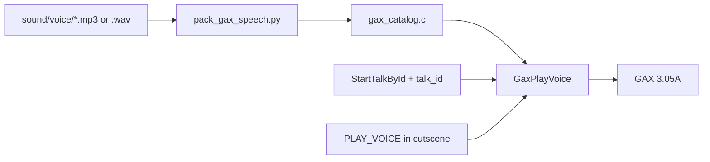

# Custom GAX Audio

---

## Index

- [Introduction](#introduction)
- [Plan](#plan)
- [Adding a voice clip from MP3](#adding-a-voice-clip-from-mp3)
- [Code Locations](#code-locations)
- [TODO](#todo)
- [Limitations & Bugs](#limitations--bugs)

## Introduction

Sigma Star Saga ships with Shin'en **GAX Sound Engine 3.05A**, not m4a. Custom music and voice-acted dialogue need to ride that driver and be triggerable from event scripts **or** map talks.

This feature adds:

1. A thin C API over the vanilla GAX stubs (`PlayBgm`, `PlaySfx`, …).
2. Boot LynJump that sets **`GAX_SPEECH`** and installs a custom speech table.
3. Packers + catalogs under `sound/` for music modules and speech blobs (WAV or MP3).
4. Event opcodes `PLAY_BGM` / `PLAY_VOICE` / `STOP_*` for the cutscene runner.
5. Optional `talk_id` on voice JSON → auto-play when `StartTalkById` runs (map NPC talks).

## Plan

| Layer | Behavior |
|-------|----------|
| Authoring | `sound/music/*.json`, `sound/voice/*.json` + WAV/MP3 |
| Pack | `tools/pack_gax_song.py`, `tools/pack_gax_speech.py` (ffmpeg for MP3), `tools/build_gax_catalog.py` |
| Runtime | `GaxPlayMusic` / `GaxPlayVoice` in `gax_audio_hooks.c` |
| Events | `PLAY_BGM(id)` / `PLAY_VOICE(id)` macros → runner opcodes 40–43 (cutscene FSMs) |
| Talk lines | `TALK(..., VOICE(id)|VOICE_STOP, "…")` → `gTalkVoiceCues` + `TalkAdvance` LynJump |
| Toggle | `.custom_gax_audio` (+ `.custom_dialogue` for TALK cues) |

**Music IDs** index `gGaxMusicTable[]` (vanilla ROM module pointers or packed blobs).

**Voice IDs** index `gGaxVoiceTable[]`. Playback uses `PlaySfx(0x100 + id, pan)` on the GAX_SPEECH path. Speech payload layout:

- Bytes `[0, bit_offset)`: 33-byte frames (first nibble `0xD`)
- Bytes `[bit_offset, …)`: 1-bit gate stream (mixer ticks)
- Entry `sizeFlags = 0x80000000 | bit_offset`



## Adding a voice clip from MP3

1. Drop the file under `sound/voice/`, e.g. `01_tierney_briefing.mp3`.
2. Add a JSON sibling:

```json
{
  "id": 1,
  "name": "tierney_briefing",
  "src": "01_tierney_briefing.mp3"
}
```

3. Ensure **ffmpeg** is available (`PATH`, `tools/bin/ffmpeg`, or `FFMPEG=…`).
4. Attach clips on talk lines (map NPC talks and cutscene talks):

```c
TALK(SPEAKER_RECKER, SIDE_LEFT, EXPR_NEUTRAL, VOICE(GAX_VOICE_TIERNEY_BRIEFING),
    "Commander Tierney, Sir!")
TALK(SPEAKER_TIERNEY, SIDE_RIGHT, EXPR_NEUTRAL, VOICE_STOP,
    "At ease Recker.")
TALK(SPEAKER_TIERNEY, SIDE_RIGHT, EXPR_NEUTRAL, VOICE(1),
    "Let me be the first to congratulate you…")
```

| Cue | Behavior |
|-----|----------|
| `VOICE(id)` / `VOICE(GAX_VOICE_*)` | Play catalog clip when this portrait line starts |
| `VOICE_STOP` | Stop speech when this line starts |
| *(omit)* | Leave audio unchanged |

5. Set `.custom_gax_audio = TRUE` and `.custom_dialogue = TRUE`, then `make`.

**Cutscene FSM scenes** can still use `PLAY_VOICE(id)` / `STOP_VOICE()` as runner ops; prefer `VOICE(...)` on `TALK` for line-synced dialogue.

## Code Locations

| Feature | Location | Description |
|---------|----------|-------------|
| GAX wrappers | `PlaySfx` / `PlayBgm` / `GaxBootInit` in `src/gax.c` | Vanilla stub shapes + boot fragment |
| Public types | `include/gax.h` | `Gax2Params`, `GaxSpeechEntry`, `GAX_FLAG_SPEECH` |
| Custom runtime | `GaxBootInit__Replacement` in `src_custom/gax_audio_hooks.c` | Speech flag + table install |
| Map-talk VO | `TalkAdvance_Gax__Replacement` in `gax_audio_hooks.c` | Per-`TALK` `VOICE(...)` cues |
| Continue trampoline | `GaxBootInit__Continue` in `asm/gax_trampoline.s` | Resume AgbMain @ `0x080038FA` |
| Catalog API | `GaxPlayMusic` / `GaxPlayVoice` in `gax_audio_hooks.c` | ID → module / speech |
| Event ops | `Runner_ExecSegment` in `src_custom/event_runner_hooks.c` | Opcodes 40–43 |
| Authoring macros | `PLAY_BGM` / `PLAY_VOICE` / `VOICE` on `TALK` | Scene scripts |
| Packers | `tools/pack_gax_*.py`, `tools/build_gax_catalog.py` | Export pipeline |
| LynJump gate | `apply_gax_audio` in `tools/apply_lynjump.py` | Boot @ `0x080038D8` + TalkAdvance @ `0x080102BC` |
| RAM symbols | `gGaxParams` / `gGaxWorkspacePtr` in `asm/ram_map_iwram.s` | GAX IWRAM map |

## TODO

- [ ] Improve speech frame encoder to match GAX decode (`0x0805708C`) more closely
- [ ] Furnace / tracker → song IR importer
- [ ] `WAIT_VOICE` event op (yield until speech index clears)
- [ ] Expand music packer beyond vanilla_module + minimal blob
- [ ] Auto-stop voice when talk UI closes (today: use `VOICE_STOP` on a later line)

## Limitations & Bugs

- The speech codec is proprietary; the WAV/MP3 packer emits best-effort `0xD0` frames and may sound wrong until the encoder is matched to `0x0805708C`.
- Minimal packed songs (non-`vanilla_module`) are experimental; prefer `vanilla_module` ROM pointers for reliable BGM.
- GAX binary remains Shin'en proprietary; only our wrappers/packers/docs are project-owned.
- Enabling `.custom_gax_audio` LynJumps AgbMain’s GAX boot and `TalkAdvance`; leave it `FALSE` for a vanilla boot/talk path.
- Per-line `VOICE(...)` cues require `.custom_dialogue = TRUE` so banks (and cue pointers) match in-game streams.
- Mix stays **0x1000 IWRAM** at `0x03005910`.
- **`GAX_SPEECH` is not enabled at runtime yet** — our packed frames are not IRQ-safe and white-screen the boot path when the flag is set. `VOICE(...)` macros and the catalog still build; `GaxPlayVoice` is a no-op until the encoder matches `0x0805708C`.
- MP3→WAV conversion runs at build time via ffmpeg.

Report playback glitches with the catalog id and whether `.custom_event_runner` was on.
