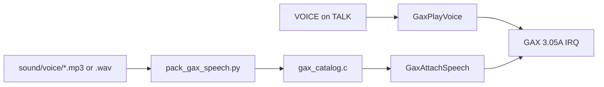

# Custom GAX Audio

---

## Index

- [Introduction](#introduction)
- [Plan](#plan)
- [Adding a voice clip from MP3](#adding-a-voice-clip-from-mp3)
- [IRQ-safe speech attach](#irq-safe-speech-attach)
- [Code Locations](#code-locations)
- [TODO](#todo)
- [Limitations & Bugs](#limitations--bugs)

## Introduction

Sigma Star Saga ships with Shin'en **GAX Sound Engine 3.05A**, not m4a. Custom music and voice-acted dialogue need to ride that driver and be triggerable from event scripts **or** map talks.

This feature adds:

1. A thin C API over the vanilla GAX stubs (`PlayBgm`, `PlaySfx`, …).
2. Boot LynJump that inits GAX, then **attaches** a separate IWRAM speech object and enables `GAX_SPEECH`.
3. Packers + catalogs under `sound/` for music modules and speech blobs (WAV or MP3).
4. Event opcodes `PLAY_BGM` / `PLAY_VOICE` / `STOP_*` for the cutscene runner.
5. Per-line `VOICE(...)` / `VOICE_STOP` on `TALK` for map NPC talks.

## Plan

| Layer | Behavior |
|-------|----------|
| Authoring | `sound/music/*.json`, `sound/voice/voice_clips.json` + WAV/MP3 |
| Pack | `tools/pack_gax_speech.py`, `tools/pack_gax_song.py`, `tools/build_gax_catalog.py` |
| Runtime | `GaxPlayMusic` / `GaxPlayVoice` / `GaxAttachSpeech` in `gax_audio_hooks.c` |
| Events | `PLAY_BGM(id)` / `PLAY_VOICE(id)` macros → runner opcodes 40–43 (cutscene FSMs) |
| Talk lines | `TALK(..., VOICE(id)|VOICE_STOP, "…")` → `gTalkVoiceCues` + `TalkAdvance` LynJump |
| Toggle | `.custom_gax_audio` (+ `.custom_dialogue` for TALK cues) |

**Music IDs** index `gGaxMusicTable[]` (vanilla ROM module pointers or packed blobs).

**Voice IDs** index `gGaxVoiceTable[]`. Playback uses `PlaySfx(0x100 + id, pan)` on the GAX_SPEECH path.

Speech payload layout (decoder @ `0x0805708C`, consumer @ `0x08056A30`):

- Bytes `[0, bit_offset)`: 33-byte (`0x21`) frames; first nibble **must** be `0xD`
- Remaining **260 bits** unpack MSB-first into **76 halfwords** at speech-state `+0x3F8..+0x48E` (see `FIELD_TABLE` in `tools/pack_gax_speech.py` / `GaxSpeechDecodeUnpack`)
- Bytes `[bit_offset, …)`: 1-bit gate stream (mixer ticks; `1` = decode)
- Entry `sizeFlags = 0x80000000 | bit_offset`
- Idle speech index at object `+0x798` is **`-1`**
- ~**40 samples/frame** at 13379 Hz (ROM init stores `0x28`)
- Synthesis (ROM): `0x08056F88` → `0x08056B74` → `0x08056D34`, mix stub via object `+0x794`


## Adding a voice clip from MP3

1. Drop the file under `sound/voice/`, e.g. `tierney_line.mp3`.
2. Add an entry under the matching chapter in [`sound/voice/voice_clips.json`](../sound/voice/voice_clips.json):

```json
{
  "id": "GAX_VOICE_TIERNEY_BRIEFING",
  "index": 1,
  "chapter": "chapter_01",
  "src": "tierney_line.mp3",
  "pitch_semitones": -4
}
```

(`chapter` is metadata only; the clip must also sit in that chapter’s array.)

3. Ensure **ffmpeg** is available (`PATH`, `tools/bin/ffmpeg`, or `FFMPEG=…`).
4. Attach clips on talk lines:

```c
TALK(SPEAKER_RECKER, SIDE_LEFT, EXPR_NEUTRAL, VOICE(GAX_VOICE_TIERNEY_BRIEFING),
    "Commander Tierney, Sir!")
TALK(SPEAKER_TIERNEY, SIDE_RIGHT, EXPR_NEUTRAL, VOICE_STOP,
    "At ease Recker.")
```

| Cue | Behavior |
|-----|----------|
| `VOICE(id)` / `VOICE(GAX_VOICE_*)` | Play catalog clip when this portrait line starts |
| `VOICE_STOP` | Stop speech when this line starts (`+0x798 = -1`) |
| *(omit)* | Leave audio unchanged |

5. Set `.custom_gax_audio = TRUE` and `.custom_dialogue = TRUE`, then `make`.

Host check: `python3 tools/test_gax_speech_pack.py`.

## IRQ-safe speech attach

`Gax2Init` with `GAX_FLAG_SPEECH` carves **`0x7A4`** out of the mix workspace. The vanilla mix is only **`0x1000`** at `0x03005910` and ends at **`gOamCursor`** — enabling speech during init overflows OAM and breaks talk UI.

Safe sequence:

1. `Gax2Init` with speech flag **clear** (mix stays `0x1000`).
2. `GaxAttachSpeech` (IRQ masked): zero `gGaxSpeechObject` @ `0x03004348`, install owner header (`*(obj+0)+0x14` → `gGaxVoiceTable`), call ROM init `@ 0x0805770C` (index `-1`), mirror vanilla workspace fields (`*(workspace+0x14) = object`, `*(workspace+0x2C) = *(workspace+0x24)`), keep **`GAX_FLAG_SPEECH` clear**.
3. `GaxAttachSpeech`, `GaxPlayVoice`, and `GaxStopVoice` suspend master IRQ while they mutate speech state. `GaxPlayVoice` re-attaches, refreshes `+0x14/+0x2C`, sets `GAX_FLAG_SPEECH`, then calls `PlaySfx(0x100+id)` atomically; `GaxStopVoice` clears index `+0x798` and the flag atomically.
4. Owner header `gGaxSpeechOwner` lives in the IWRAM free pool (word-aligned). A `.bss` static at `0x03000000` previously stomped vanilla RAM and crashed talk.
5. `PlayBgm` clears the flag before any re-`Gax2Init`, then calls `GaxAttachSpeech` again.
6. Packer analyses PCM (pitch / energy / voiced / bands) into the 260-bit field table; silence is the all-zero coefficient vector under header `0xD`.
7. Temporary No$GBA logs on attach/play/stop plus a consumer LynJump probe @ `0x08056A30` (`GaxSpeechConsumer__Replacement`) — remove once in-emulator validation is done.
## Code Locations

| Feature | Location | Description |
|---------|----------|-------------|
| GAX wrappers | `PlaySfx` / `PlayBgm` / `GaxBootInit` in `src/gax.c` | Stub shapes; PlayBgm re-attaches speech |
| Public types | `include/gax.h` | `Gax2Params`, `GaxSpeechEntry`, `GAX_FLAG_SPEECH` |
| Decode contract | `include/gax_speech.h`, `src/gax_speech_decode.c` | Frame validate / unpack notes for `0x0805708C` |
| Custom runtime | `GaxBootInit__Replacement` / `GaxAttachSpeech` / consumer probe in `gax_audio_hooks.c` | Separate speech object + flag + workspace mirror |
| Map-talk VO | `TalkAdvance_Gax__Replacement` in `gax_audio_hooks.c` | Per-`TALK` `VOICE(...)` cues |
| Continue trampoline | `GaxBootInit__Continue` in `asm/gax_trampoline.s` | Resume AgbMain @ `0x080038FA` |
| Catalog API | `GaxPlayMusic` / `GaxPlayVoice` / `GaxStopVoice` | ID → module / speech; stop clears index |
| Event ops | `Runner_ExecSegment` in `src_custom/event_runner_hooks.c` | Opcodes 40–43 |
| Packers | `tools/pack_gax_*.py`, `tools/test_gax_speech_pack.py` | Export + host smoke test |
| LynJump gate | `apply_gax_audio` in `tools/apply_lynjump.py` | Boot @ `0x080038D8` + TalkAdvance @ `0x080102BC` + temp consumer @ `0x08056A30` |
| RAM | `gGaxMixBuffer` / `gGaxSpeechObject` in `asm/ram_map_iwram.s` | Mix `0x1000` + speech `0x7A4` |

## TODO

- [ ] Remove temporary speech consumer probe / No$ attach logs after in-emulator Gate 1–4 sign-off
- [ ] Tighten host reference synth toward ROM `0x08056F88` / `0x08056B74` for lower PCM error
- [ ] Furnace / tracker → song IR importer
- [ ] `WAIT_VOICE` event op (yield until speech index clears)
- [ ] Expand music packer beyond vanilla_module + minimal blob
- [ ] Auto-stop voice when talk UI closes (today: use `VOICE_STOP` on a later line)

## Limitations & Bugs

- Vocoder encoder is analysis-based (`pcm_vocoder_v1`); it is audible speech-shaped audio, not a bit-exact Shin'en encoder. Host `test_gax_speech_pack.py` checks field round-trip + bounded PCM error vs the reference synth.
- Temporary consumer LynJump @ `0x08056A30` logs the first active tick then continues into vanilla — restore when validation is finished.
- Minimal packed songs (non-`vanilla_module`) are experimental; prefer `vanilla_module` ROM pointers for reliable BGM.
- GAX binary remains Shin'en proprietary; only our wrappers/packers/docs are project-owned.
- Enabling `.custom_gax_audio` LynJumps AgbMain’s GAX boot, `TalkAdvance`, and (temporarily) the speech consumer; leave it `FALSE` for a vanilla boot/talk path.
- Per-line `VOICE(...)` cues require `.custom_dialogue = TRUE` so banks (and cue pointers) match in-game streams.
- Mix stays **0x1000 IWRAM** at `0x03005910`. Speech object is **`gGaxSpeechObject` @ `0x03004348` (`0x7A4`)**. Owner header is free-pool IWRAM (`gGaxSpeechOwner`) — never `.bss`.
- `GaxStopVoice` writes `-1` to `+0x798` only — do not use `StopAllFx` for voice stop (it kills BGM channels).
- MP3→WAV conversion runs at build time via ffmpeg.

Report playback glitches with the catalog id and whether `.custom_event_runner` was on.
